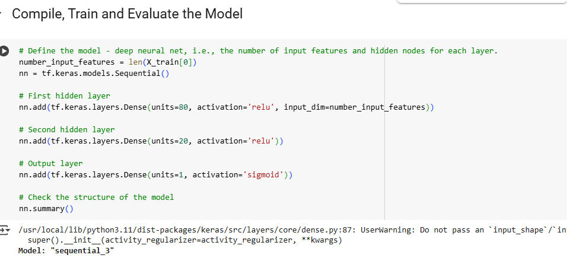
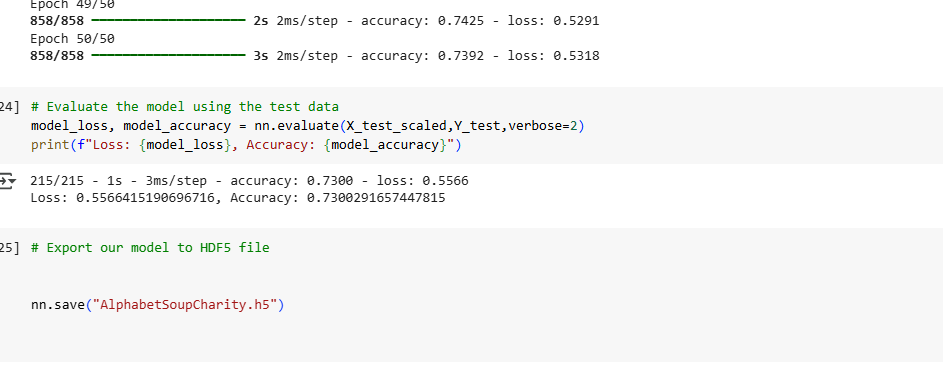
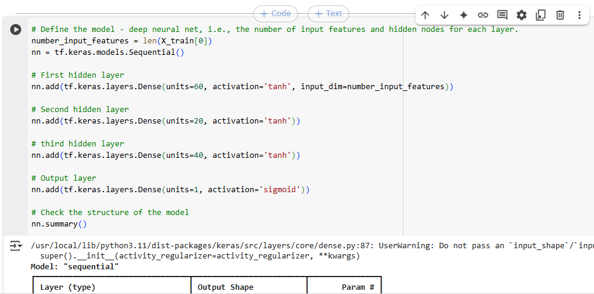
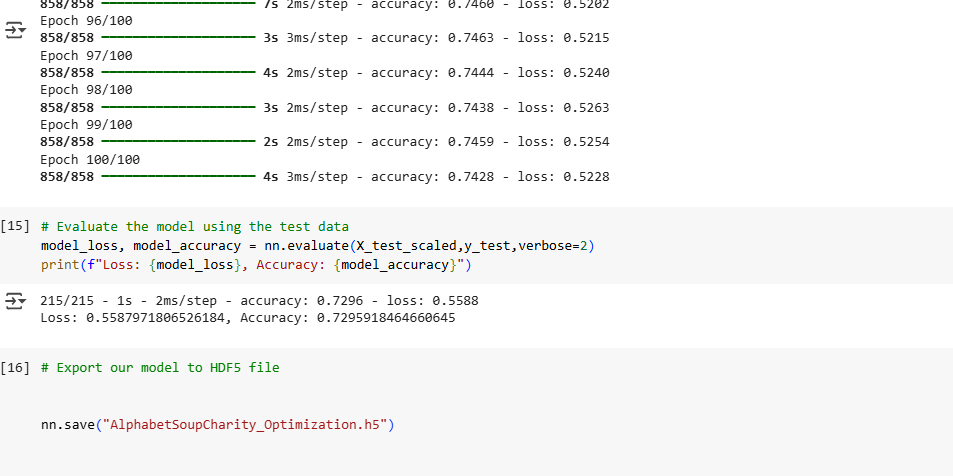
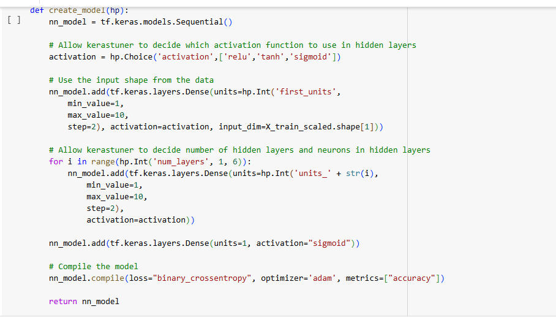

# deep-learning-challenge

# Analysis

# Purpose
In this project, we'll use a deep learning model, to create a binary classification model that can predict if an Alphabet Soup-funded organization will be successful based on the features in the dataset. I will be using machine learning and neural networks to analyze a CSV containing over 34,000 organizations that have received funding from Alphabet Soup, using metadata columns to predict the success of future applicants.

# Results
# Data Preprocessing
- What variable(s) are the target(s) for your model?
The target for each model was the IS_SUCCESSFUL column. The ultimate goal is to predict which applicants will be successful, so we will utilize all other features to ultimately make a predict

- What variable(s) are the features for your model?
The available features for my model are: EIN, NAME, APPLICATION_TYPE, AFFILIATION, CLASSIFICATION, USE_CASE, ORGANIZATION, STATUS, INCOME_AMT, SPECIAL_CONSIDERATIONS, and ASK_AMT

- What variable(s) should be removed from the input data because they are neither targets nor features?
The EIN and NAME columns were removed from the input data as they are identification columns and not useful as features or targets.

# Compiling, Training, and Evaluating the Model

How many neurons, layers, and activation functions did you select for your neural network model, and why?
Were you able to achieve the target model performance?
What steps did you take in your attempts to increase model performance?

Compiling, Training, and Evaluating the Model
Neurons, layers, and activation functions selected for the neural network model and rationale: The model consists of three hidden layers with 80, 30, and 1 neurons, respectively, and ReLU activation functions. The output layer uses a sigmoid activation function for binary classification. The structure was chosen to provide a balance between complexity and the potential for overfitting, while maintaining the ability to learn complex patterns in the data.

The first model had a lower accuracy at .72, but a higher loss percentage of .59. It used 2 hidden layers with 50 neurons each utilizing the ReLU activation, with a Sigmoid activation for the output layer. The choice of ReLU was based on the observation that the data was non-linear.

The second model used the Tanh activation in an attempt to increase model accuracy. It had 3 hidden layers with 100 neurons each, I upped the neurons to try and avoid overfitting but was unsuccessful. The model accuracy against the test data was still the same.

In my THIRD and final model, I chose auto-optimization to get the best model and hyperparameters to obtain accuracy higher than 73%. This model has 3 layers, with the first layer having 7 neurons and the remaining layers having 5, 5, 1, 7, and 5 neurons respectively. The activation function used throughout this model is sigmoid.

The model accuracy against the test data was still the same at 73% with a loss of 55%

- Were you able to achieve the target model performance?

I wasnt much successful in my 2nd optimization in achieving a target model performance of 75% or higher in all attempts.

- What steps did you take in your attempts to increase model performance?

In my second optimization I added a third hidden layer, and utilized Tanh algorithm instead of Relu which I used in the first attempt.

# Summary
The deep learning model achieved a performance of 73% accuracy in predicting the success of Alphabet Soup-funded organizations. Several attempts were made to optimize the model through data preprocessing and neural network structure adjustments, ultimately leading to no improved performance.

Achievement of the target model performance: The model did achieve the target performance of 78.5% accuracy. However, multiple attempts were made to optimize the model, including adjusting input data, modifying the structure of the neural network, and modifying the training regimen.

Steps taken in attempts to increase model performance: To increase model performance, the following steps were taken:

Dropping additional irrelevant columns from the input data.
Creating more bins for rare occurrences in columns and adjusting the number of values for each bin.
Adding more neurons to a hidden layer.
Adding or removing hidden layers.
Using different activation functions for the hidden layers.
Increasing or decreasing the number of epochs in the training regimen.

